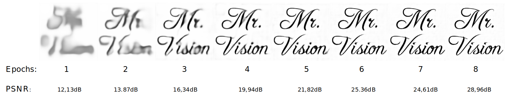

# Watermark-DnCNN
## Intro

This repo refers to Watermarking Dnns paper you can find [here](https://ieeexplore.ieee.org/document/9093125).

# Requirements

In order to execute this code, following programs are required:
- __Python 3.7__
- __tensorflow 1.15__ (tested, but can be either higher or slithy slower)
- __Pillow__, __OpenCV__, __Matplotlib__, __Numpy__ (for windows use max numpy version 1.19.3 becayse 1.19.4 will fail sanity check)

It is advised to install tensorflow in an environment (venv or conda) for better management.

## Folders

Below scripts saves training checkpoints in various folders. Those directories are used:

- __DnCNN_weight__: contains dncnn's weights after been trained for 45 epochs. This is used as 'basic model' like the customer's model that needs to be watermarked.
- __overwriting__: contains checkpoints from retraining base dncnn model (in DnCNN_weight) for watermarking.
- __combine_weight__: contains checkpoints from retraining other models. Used as Deep Prior model (Auxiliary Visualizer).

## Fast start

In order to test the repo, execute:

1. __GeneratorTriggerVerificationImg.py__ that will create keys folder with Trigger and Verification images
1. __Preprocess_dataset_for_dncnn.py__ that will create all needed datas
1. __Watermark_train.py__ in order to train dncnn for 8 epochs (ckpt saved in overwriting)
1. __AuxVisualizer_train.py__ in order to train Prior model for 8 epochs (ckpt saved in combine_weight)
1. __ExecuteFineTuning.py__ in order to finetune watermarked model (ckpt saved in fineTuning_weight)
1. __ExecutePruning.py__ in order to prune watermarked model (ckpt saved in pruning_weights)
1. __PaperAnalysis__ reproduces the uniqueness, fidelity and robustness tests and shows interesting plots

** __note__: the scripts above, in 1, 2, 3, 4 can be run directly via the *fastrun_train.py*

# Scripts description

Following python files are only used as import modules for other scripts:

- __DnCNN_model.py__: contains all functions needed to create the dncnn model (also with loss and optimizer). If it is
  runned, it will compile and run once the dncnn printing all layers and testing if allright
- __AuxVisualizerModel.py__: contains all functions needed to create Deep Prior model (also with loss and optimizer)
- __utility.py__: contains utility functions for file store and other utilities
- __WatermarkedTrainedModel.py__ nad __WatermarkedVisualizerModel__: easy to use wrappers for needed modules for Paper tests
All the scripts can be logically splitted into those categories:
- __prunings.py__: contains utility functions for weight and unit pruning on tensorflow Variable

- __Preprocessors__: *DnCNN_test.py* for basic environment test, *GeneratorTriggerVerificationImg.py* for trigger/verification keys, *Preprocess_dataset_for_dncnn.py* for numpy datasets creation
- __Fast run scripts__: *fastrun_train.py* and *fastrun_test.py*
- __Watermarking training__: *DnCNN_model.py* (model lib), *Watermark_train.py* for embedding watermark
- __Auxiliary visualizer__: *AuxVisualizerModel.py* (model lib), *AuxVisualizer_train.py* for training 8 epochs
- __Model storing library__:  *WatermarkedTrainedModel.py* (fast loading class to manage a model from checkpoint)
- __Principles related scripts__: *ExecuteFineTuning.py* for Finetuning on 100 epochs (on Img12 or KTH dataset), *ExecutePruning.py* for pruning with k% weights, prunings.py (pruning utility lib)
- __Paper results checking__: *PaperAnalysis.py*

# Approaces tested thru PaperAnalysis
Script **PaperAnalysis.py** tests given dncnn model on:

- Uniqueness
- Robustness (finetuning)
- Robustness (pruning)
- Watermarking vs Original model output
- Fidelity

Just set boolean **True** on interesting variables in PaperAnalysis main's method and run it.
When show_images parameter (from various methods) is set to True, remember to press space on image to go further (opencv imshow method manages it that way).
Results are saved in **results** subfolders with images and json datas.
Below are some visual simple results tested.

# Results

All the results can be viewed in attached paper (TBD).

## Watermarking the dnn
Finetuning all layers with trigger/verification key results in watermarking embedding:

## Robustness against Finetuning
When finetuning last convolutional layer, the watermark is keep even for first 100 epochs.

## Robustness against Pruning
When Pruning all convolutional layers, the watermark is kept until k=60%.

\
\
**Original code**: [painfulloop](https://github.com/painfulloop) (Main paper author)

**Paper results implementation contributors**: [Fabian Greavu](https://github.com/fabian57fabian) and [Scaramuzzino Giovanna](https://github.com/ScaramuzzinoGiovanna) (scripts and results added within *Image Processing & Security* course project at the *Department of Information Engineering* of the *University of Florence* under Prof. *Alessandro Piva*'s supervision)
